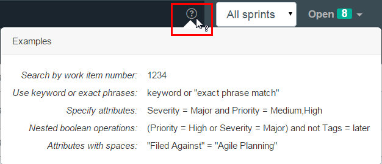
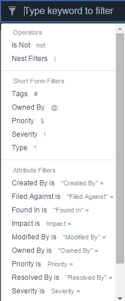

[rtcWorkItemDoc]: http://www-01.ibm.com/support/knowledgecenter/SSYMRC_5.0.2/com.ibm.team.workitem.doc/topics/t_creating_work_items_web.html 

# Track and plan

Last updated: 7 July 2015

With the Track & Plan feature, you track work for a project through work items. For example, if you find a bug in someone's code, you can open a Defect work item and assign it to the person who owns the code.

---

* [Creating work items](#creatingwis)
* [Work item states](#wistates)
* [Work item display options](#widisplay)
* [Filtering work items](#filteringwis)
* [Viewing and organizing work items](#organizingwis)
* [Triaging work items](#triaging)
* [Planning the work for your team](#planning)
* [Reviewing the team's progress](#progress)

--- 

##Creating work items
You can create a work item in more than one way. How you set up a work item depends on how you create it. For example, if you create a work item in the My Work view, you own the work item automatically. To set the attributes, click the icons, as shown in the following image. You can also open and edit a work item's attributes by clicking its summary. 

**Note**: Some attributes are available for only specific work item types. For example, the Severity attribute type is available for Defect work items only.

For more information about creating work items and defining their attributes, [see the documentation for IBM&reg; Rational Team Concert&#8482;][rtcWorkItemDoc]. 

##Work item states
- **Open**: The work item is not started yet. Its status is New.
- **In progress**: The work item is started. Its status is In progress.
- **Resolved**: The work item is finished. Its status is Complete or Invalid.

##Work item display options
###List 
When you view work items in a list, each work item spans the width of the list. You can see more information about a work item by expanding it. Attributes are shown as icons.

###Table  
When you view work items in a table, each work item is in a condensed format. Some attributes are shown as icons and text and are arranged into columns.

###Lanes
When you view work items in lanes, the work items are grouped by states. Attributes are shown as icons. You can view two states at a time. To view the third state, scroll horizontally.

##Filtering work items

You can filter work items based on words or on values for specific attributes. Filtering is supported in these views:
- My Work
- My Subscribed
- Incoming Work
- Backlog
- Sprint Planning
- Team's Work
- All Work

If you type a word, the work item summaries that contain that word are shown. You can also filter work items based on values for specific attributes. For details, see the following table.

| Attribute |Example | 
|-------|-------|
|*Type  | `*Defect` |
|#Tag  | `#conference`| 
|@:Owner  | `@:jasmith`|
|$Priority|`$High`|
|!Severity|`!Major`|       
   

You can create queries that use any work item attribute by typing the attribute name. For example, if you type `Created by`, the query options and the syntax are shown. You can use operators, such as "and," "or," and "not" in your filter criteria. You can also include complex operations that nest multiple operators by using parentheses. To see examples, click the **Help** icon. 

When you click the **Filter work items by keyword** field, the operators and filters that you can use to create queries are shown.

###Saving custom views
You can create custom views by applying filters. Then, you can share the views with your team. 
1. In the **Filter work items** field, type the short-form of an attribute type and a value for that attribute; for example, `$high`. Some attribute choices are automatically listed when you type the short-form; for example, *Type, $Priority, and !Severity.

2. Click **SAVE**.
3. Name the view. 
4. If you want the custom view to include the sprint that you're viewing, select the check box to include the sprint. In the following example, the Backlog sprint will be included in the "High priority backlog" view.

5. Click **SAVE**. 
6. If you want to share your saved views with your team, in the Custom Views section, click the share icon next to the new view. Then, click **OK**.

Custom views return results for only the current sprint and status that you're viewing. If you want the view to return results for more sprints or statuses, click the view and change it as needed.

##Viewing and organizing your work items

- To view work items that you own, see the My Work view. 
- If you often use specific work items, you can mark them as your favorites by clicking their Star icons . Then, you can see all of your favorite work items in the My Starred view. When you click the Star icon for a work item, only you can see that you marked it as a favorite.  
- To view all of the work items that you are subscribed to, see the My Subscribed view.
- To view your work items sorted by their modified dates, see the My Recent Work view.
- To view your work item activity, see the My Activities view. The My Events section lists the work items that you were mentioned in. The My Subscriptions section lists all of the changes that occurred in work items that you are subscribed to.

##Triaging work items

When a work item is created but not assigned to a sprint, the work item is shown in the Incoming Work view.
As soon as a work item is assigned to a sprint, it is removed from the Incoming Work view.

In the Incoming Work view, you can triage work items in several ways: 
- To reject the work item, click the **Trash this item** icon . The work item is resolved and its status is changed to Invalid.
- To accept the work item and assign it to the Backlog, click the **Triage to backlog** icon . Then, you can evaluate the work item against other work items in the Sprint Planning view and assign the work item to a sprint.
- To assign the work item to a sprint, open the work item and select a value from the **Planned for** list.

##Planning the work for your team
In the Sprint Planning view, you can plan sprints by dragging work items between sprint lanes. To reassign work items, drag them between the lanes.  

**Tip:** If you keep the Backlog open, you can quickly move work items from it to a specific sprint. To keep the Backlog open, click the **Pin** icon .

You can also review statistics about the sprint's progress:
- Hours worked vs. total hours estimated
- Work items completed vs. total work items
- Story points achieved vs. total story points estimated

###Ranking work items
While you plan a sprint, review the work items in the Backlog and Sprint Planning views to rank the work items. Rank work items and assign story points to them by dragging work items into position.

##Reviewing the team's progress
You can review all of the work items that are assigned to the team in the Team's Work view.

You can also review these statistics:
- Hours worked vs. total hours estimated
- Work items completed vs. total work items
- Story points achieved vs. total story points estimated

To review all of the work items by state, see the All Work view.

