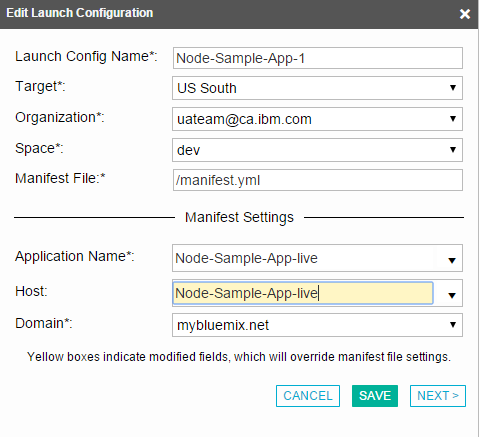
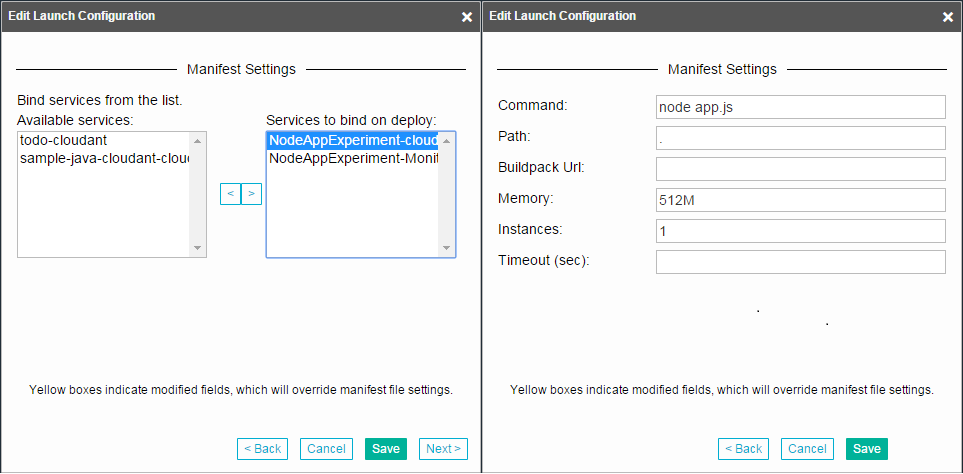
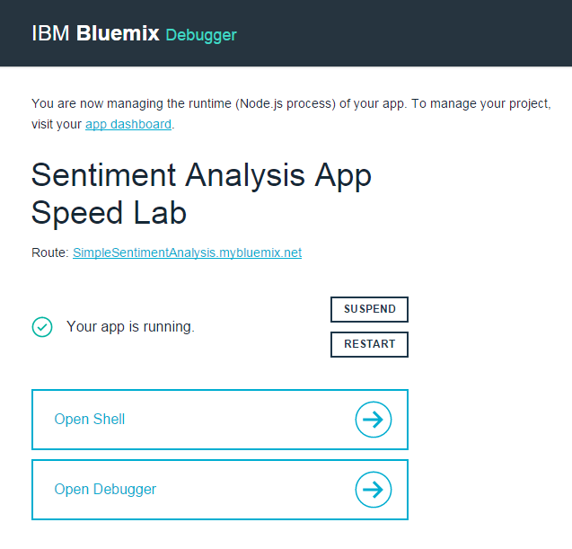
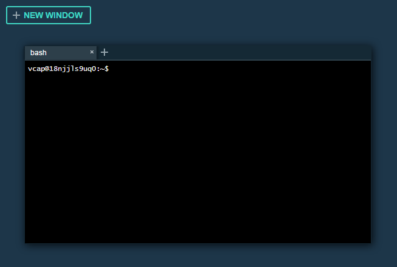
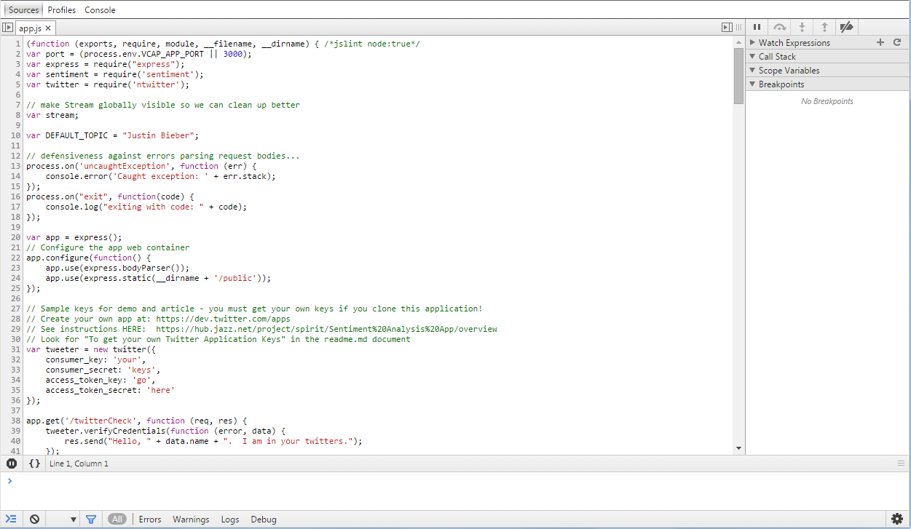

#Test and debug a Node.js app with Bluemix Live Sync

###### Last updated: 20 August 2015

Testing and debugging are critical to ensure that your app performs without unexpected results. In IBM&reg; Bluemix&trade; DevOps Services, you can test and debug Node.js apps right from the Web IDE. Bluemix Live Sync provides tools to deploy and make changes to your code within a test environment. You can view simple code updates immediately in the running app without the need to redeploy. Bluemix Live Sync works both from the Web IDE or the command line, so you can choose where to develop your app while having all of the benefits of deploying with Bluemix.

In this tutorial, you create a launch configuration that you use to deploy a Node.js app to a test environment. You enable Live Edit mode in the Web IDE, and then debug your app. If you prefer to work from the command line, you can set up the Bluemix Live Sync command-line tool.

<div class="table-of-contents">
 <table>
   <tr>
     <td colspan="8"><h4>Table of Contents</h4></td>
   </tr>
   <tr>
     <td><a href="#prereq">Before you begin</a></td>
     <td><a href="#runbar">The run bar</a></td>
     <td><a href="#launch_configuration">Create a launch configuration</a></td>
     <td><a href="#deploy_app">Deploy an app to a test environment</a></td>
     <td><a href="#live_edit">Turn on Live Edit mode</a></td>
     <td><a href="#debug">Debug a Node.js app</a></td>
     <td><a href="#local_edit">Test and debug on the command line</a></td>
     <td><a href="#summary">Summary</a></td>
   </tr>
 </table>
</div>


<a name='prereq'></a>
##Before you begin 
* [Sign up for DevOps Services](https://hub.jazz.net/register). When you sign up, you'll create an IBM id, create an alias, and register with Bluemix.
* If you don't already have a Node.js project to work with, [create one](https://hub.jazz.net/tutorials/jazzeditor).
* To develop locally from your desktop, download and install the Bluemix Live Sync command-line interface for [Windows](https://jazz.net/pub/bluemixlive/blive_setup.msi) or for [Mac OS X](http://livesync.mybluemix.net/downloads/BluemixLive.pkg).

 **Important:** The Live Sync command-line interface is available only for Windows 7 and 8 and Mac OS X version 10.9 or later. [Learn more about the Live Sync command-line interface](https://www.ng.bluemix.net/docs/#manageapps/bluemixlive.html#live_sync_cli).


<a name='runbar'></a>
##The run bar
The run bar, which is located within the Web IDE, provides all of the controls for Bluemix Live Sync.  On the bar, you can see the deployed state of your app.  You can also deploy, stop, and open the app, open its Dashboard, and view logs.  If you're developing a Node.js app, the run bar contains additional icons to enable Live Edit mode, quickly restart the app, and open debugging tools.


You can use the run bar to quickly test and debug code in a personal environment before you push the code into production.  When you use the run bar to deploy your code, only the code that is currently in your workspace is deployed.  You have complete control to test and experiment before you check in any of your code.


<a name='launch_configuration'></a>
##Create a launch configuration

Launch configurations define the settings that the Web IDE uses to deploy your app on Bluemix. By default, DevOps Services deploys to the bound Bluemix app that is associated with the DevOps Services project.  If you want to deploy your app locally, you first must create a launch configuration.

1. On the run bar, click the **Launch configuration** list and then click the **Create a new launch configuration** icon.

2. In the Edit Launch Configuration window, indicate that this is a test version of your app by adding text to the app's name and host. In the following example, `–live` is added to the name and host.  DevOps Services provides an initial launch configuration name automatically, but you can change the name if needed.

3. Click **Next** to edit the manifest settings for the launch configuration.  The manifest file defines how your project is deployed.  The file includes information such as memory and instance allotments and is also where you can specify any services to bind to the app.  You can create several launch configurations to test different app setups.  For information about creating a manifest, [see the Bluemix documentation about application manifests](https://www.ng.bluemix.net/docs/#manageapps/index-gentopic2.html#appmanifest).<br>

4. Click **SAVE**. 

You can now use your launch configuration to deploy the contents of your workspace to the test environment that you specified in the configuration.


<a name='deploy_app'></a>
##Deploy an app to a test environment

1. To deploy your app, click the deploy icon   on the run bar. When you click the icon, an instance of your app is deployed by using the current contents of your workspace and the environment that is defined in your launch configuration.
2. After your app is deployed, you can also complete any of these actions:


 *   Stop the app.
 *   Open the deployed app.
 *   View the logs of the deployed app.
 *   Open the app's Dashboard.
 *   If you are developing a Node.js app, enable Live Edit mode.


<a name='live_edit'></a>
##Turn on Live Edit mode
Redeploying an app can waste valuable time when you are testing minor changes.  To save time, turn on Live Edit mode.  When Live Edit mode is on, you can quickly make changes to a Node.js app and preview the changes immediately.

1. On the run bar, select or create a launch configuration.
2. Click **Live Edit**. If the app is currently deployed in your workspace, it is redeployed to enable Live Edit mode.  Otherwise, the contents of your workspace are deployed in Live Edit mode by using the specified launch configuration.

3. When redeployment finishes, the deployment status icon turns green and the phrase `(running: live edit)` is shown beside your launch configuration on the run bar.


When you work in Live Edit mode, changes to static files, such as HTML or CSS, can usually be seen immediately in the deployed app.  If you make changes that affect Node.js source files, you can restart the app quickly, without redeployment, by clicking the restart icon .


<a name='debug'></a>
##Debug Node.js apps
Another benefit of Live Edit mode is the Debug feature.  You can edit code dynamically, insert breakpoints, step through code, restart the runtime, and more, while your app is running on Bluemix.

1. On the run bar, click the debug icon .

2. Select an option to manage the runtime of your app or begin debugging.

 * If you click **Open Shell**, a Bash shell is displayed.  In the shell, you can access the container that your app is running in. You can remotely run diagnostic shell commands to administer your app.

 
	
 * If you click **Open Debugger**, Node Inspector opens.  Node Inspector is a debugger interface for Node.js apps that uses the Blink Developer Tools (formerly WebKit Web Inspector).

    **Note:** Node Inspector is currently supported on Chrome and Opera browsers only.

 

 Node Inspector offers many useful debugging techniques for apps:
	* Setting breakpoints and specifying trigger conditions in code
	* Disabling or enabling all breakpoints
	* Inspecting scopes, variables, and object properties
	* Displaying the value of an expression in source code by hovering over it
	* Editing variables and object properties
	* Breaking on exceptions

 For more information about Node Inspector, see these resources:
    * [node-inspector GitHub website](https://github.com/node-inspector/node-inspector)
    * [Debugging applications on the StrongLoop website](http://docs.strongloop.com/display/SLC/Debugging+applications)


<a name='local_edit'></a>
##Test and debug on the command line

You can use Bluemix Live Sync for more than work in the Web IDE. You can also make changes in your local environment and preview them on Bluemix. To do so, use the Bluemix Live Sync command-line tool, "bl", which synchronizes your desktop with your project workspace.

**Before you begin**: [Download and install the Bluemix Live Sync command-line interface](http://livesyncdownload.ng.bluemix.net).


<a name='edit_local_download'></a>
###Synchronize your local environment with Bluemix

1. Open a command-line window.
2. Sign in to Bluemix by typing your IBM id and password:
```
bl login
```
3. View a list of your Bluemix projects: 
```
bl projects
```
4. Synchronize your local environment with your project on Bluemix:
```
bl sync projectName
```
where `projectName` is your Bluemix app's name.

By synchronizing your local environment with Bluemix, you populate `localDirectory` with the files from your Node.js project. When you are finished making changes, type `q` to end synchronization.

###Enable the Desktop Sync feature to edit code locally

The Desktop Sync feature is like Live Edit mode for the command line. To debug on the command line, you must enable the Desktop Sync feature.
1. In another command-line window, enable the Desktop Sync feature:
```
cd localDirectory
bl start
```
2. Use the launch configuration that you created in the Web IDE. After you select the launch configuration, Desktop Sync is enabled in your local environment. In the command-line window that you just opened, you can view the app's URL, the debug URL, the manage URL, and view the Bluemix Live Sync state.

3. Refresh the browser and verify that you can see the changes that you saved to static files in the local workspace. 

###Disable the Desktop Sync feature

1. In the second command-line window, enter `bl stop`.
2. In the first command-line window, press `q`.

<a name='summary'></a>
##Summary

You learned how to create a launch configuration and deploy an app from the run bar. You also used Bluemix Live Sync to edit a Node.js project and preview changes both in the cloud and locally from the command-line.

<a name='nextsteps'></a>
##Next steps

After you have tested and debugged your app, [learn more about setting up automated build and deploy processes](/docs/reference/deploy/). 
